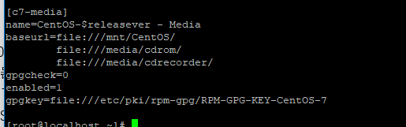
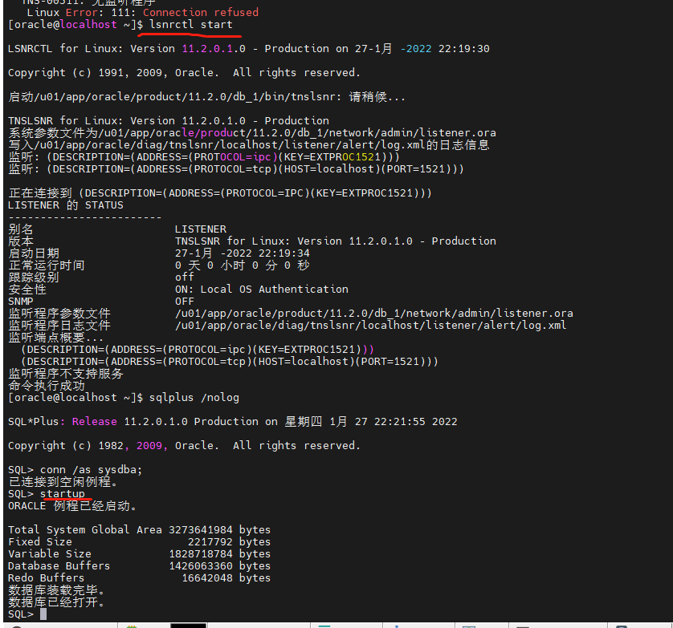

#  centos7最小化安装 服务器安装oracle11gR2

# 准备

## 1确认x86 架构cpu 

## 

命令

```
uname -m
```

- 

## 2 查看系统版本

```
cat /etc/redhat-release 
```


### **没有互联网的准备工作**

这里需要提前下载：

#### 1 下载全镜像iso 要下载系统镜像最全的

推荐阿里云下载

https://mirrors.aliyun.com/centos-vault/centos/

比如：演示系统centos 7.6

```
https://mirrors.aliyun.com/centos-vault/centos/7.6.1810/isos/x86_64/CentOS-7-x86_64-Everything-1810.iso
```

#### 配置离线软件源

##### 1 上传刚刚下载的iso镜像到服务器上然后

找到进入到 /etc/yum.repos.d/ 下面 ，备份其他的repo 只留下CentOS-Media.repo

修改CentOS-Media.repo文件改成这样 enabled=1 gpgcheck=0



iso 挂载到/mnt/CentOS 下

```
mount -o loop /xx/iso /mnt/CentOS
```

然后

```
清除旧的软件源
yum clean all 
生成缓存 
yum makecache
安装vim 
yum install vim 
```

# 1开始安装数据库-静默安装

准备依赖包文档*http://docs.oracle.com/cd/E11882_01/install.112/e24326/toc.htm#BHCCADGD*

The following or later version of packages for Oracle Linux 7, and Red Hat Enterprise Linux 7 must be installed**有这些包名字 版本可不一致**

```
binutils-2.23.52.0.1-12.el7.x86_64 
compat-libcap1-1.10-3.el7.x86_64 
compat-libstdc++-33-3.2.3-71.el7.i686
compat-libstdc++-33-3.2.3-71.el7.x86_64
gcc-4.8.2-3.el7.x86_64 
gcc-c++-4.8.2-3.el7.x86_64 
glibc-2.17-36.el7.i686 
glibc-2.17-36.el7.x86_64 
glibc-devel-2.17-36.el7.i686 
glibc-devel-2.17-36.el7.x86_64 
ksh
libaio-0.3.109-9.el7.i686 
libaio-0.3.109-9.el7.x86_64 
libaio-devel-0.3.109-9.el7.i686 
libaio-devel-0.3.109-9.el7.x86_64 
libgcc-4.8.2-3.el7.i686 
libgcc-4.8.2-3.el7.x86_64 
libstdc++-4.8.2-3.el7.i686 
libstdc++-4.8.2-3.el7.x86_64 
libstdc++-devel-4.8.2-3.el7.i686 
libstdc++-devel-4.8.2-3.el7.x86_64 
libXi-1.7.2-1.el7.i686 
libXi-1.7.2-1.el7.x86_64 
libXtst-1.2.2-1.el7.i686 
libXtst-1.2.2-1.el7.x86_64 
make-3.82-19.el7.x86_64 
sysstat-10.1.5-1.el7.x86_64
unixODBC-2.3.1-6.el7.x86_64 or later
unixODBC-2.3.1-6.el7.i686 or later
unixODBC-devel-2.3.1-6.el7.x86_64 or later
unixODBC-devel-2.3.1-6.el7.i686 or later

```

## 1.安装命令

```
yum -y install binutils compat-libcap1 compat-libstdc++-33 compat-libstdc++-33*i686 compat-libstdc++-33*.devel compat-libstdc++-33 compat-libstdc++-33*.devel gcc gcc-c++ glibc glibc*.i686 glibc-devel glibc-devel*.i686 ksh libaio libaio*.i686 libaio-devel libaio-devel*.devel libgcc libgcc*.i686 libstdc++ libstdc++*.i686 libstdc++-devel libstdc++-devel*.devel libXi libXi*.i686 libXtst libXtst*.i686 make sysstat unixODBC unixODBC*.i686 unixODBC-devel unixODBC-devel*.i686
```

检查命令

```
rpm -q binutils compat-libcap1 compat-libstdc++-33 gcc gcc-c++ glibc glibc-devel ksh libaio libaio-devel libgcc libstdc++ libstdc++-devel libXi libXtst  make sysstat  unixODBC unixODBC-devel
```

## 2 创建用户

```
新建用户组
groupadd oinstall
groupadd dba
设置用户组
useradd -g oinstall -G dba oracle
设置密码
passwd oracle
查看用户id oracle
结果
uid=1001(oracle) gid=1001(oinstall) groups=1001(oinstall),1002(dba)
```

## 3 配置内核参数

```
vim /etc/sysctl.conf

我的配置8g 
fs.aio-max-nr = 1048576
fs.file-max = 6815744
kernel.shmall = 2147483648
kernel.shmmax = 8589934592
kernel.shmmni = 4096
kernel.sem = 250 32000 100 128
net.ipv4.ip_local_port_range = 9000 65500
net.core.rmem_default = 262144
net.core.rmem_max = 4194304
net.core.wmem_default = 262144
net.core.wmem_max = 1048576
```

内存配置

```
https://blog.csdn.net/shmily_lsl/article/details/103384366
```

**百度概述**

```
1.  kernel.shmmax ：
是核心参数中最重要的参数之一，用于定义单个共享内存段的最大值。设置应该足够大，能在一个共享内存段下容纳下整个的 SGA , 设置的过低可能会导致需要创建多个共享内存段，这样可能导致系统性能的下降。至于导致系统下降的主要原因为在实例启动以及 ServerProcess 创建的时候，多个小的共享内存段可能会导致当时轻微的系统性能的降低 ( 在启动的时候需要去创建多个虚拟地址段，在进程创建的时候要让进程对多个段进行“识别”，会有一些影响 ) ，但是其他时候都不会有影响。
官方建议值：
32 位 linux 系统：可取最大值为 4GB （ 4294967296bytes ） -1byte ，即 4294967295 。建议值为多于内存的一半，所以如果是 32 为系统，一般可取值为 4294967295 。 32 位系统对 SGA 大小有限制，所以 SGA 肯定可以包含在单个共享内存段中。
64 位 linux 系统：可取的最大值为物理内存值 -1byte ，建议值为多于物理内存的一半，一般取值大于 SGA_MAX_SIZE 即可，可以取物理内存 -1byte 。  
内存为 12G 时，该值为 12*1024*1024*1024-1 = 12884901887
内存为 16G 时，该值为 16*1024*1024*1024-1 = 17179869183
内存为 32G 时，该值为 32*1024*1024*1024-1 = 34359738367
内存为 64G 时，该值为 64*1024*1024*1024-1 = 68719476735
内存为 128G 时，该值为 128*1024*1024*1024-1 = 137438953471
2.  kernel.shmall ：
该参数控制可以使用的共享内存的总页数。 Linux 共享内存页大小为 4KB, 共享内存段的大小都是共享内存页大小的整数倍。
一个共享内存段的最大大小是 16G ，那么需要共享内存页数是 16GB/4KB==4194304 （页），
当内存为 12G 时， kernel.shmall = 3145728
当内存为 16G 时， kernel.shmall = 4194304
当内次为 32G 时， kernel.shmall = 8388608
当内存为 64G 时， kernel.shmall = 16777216
当内存为 128G 时， kernel.shmall = 33554432

```

## 4修改后使之生效

```
/sbin/sysctl -p
```

## 5修改用户限制

```
vim  /etc/security/limits.conf

#在末尾添加
oracle soft nproc 2047
oracle hard nproc 16384
oracle soft nofile 1024
oracle hard nofile 65536
oracle soft stack 10240

#在/etc/pam.d/login 文件中，使用文本编辑器或vi命令增加或修改以下内容
vim /etc/pam.d/login
下面64 和32 二选一
#64 位操作系统需要
session required  /lib64/security/pam_limits.so
session required pam_limits.so
#32 位
session required /lib/security/pam_limits.so
session required pam_limits.so

```

在/etc/profile 文件中，使用文本编辑器或vi命令增加或修改以下内容

```
vim /etc/profile
if [ $USER = "oracle" ]; then
   if [ $SHELL = "/bin/ksh" ]; then
       ulimit -p 16384
       ulimit -n 65536
    else
       ulimit -u 16384 -n 65536
   fi
fi
```

使之生效

```
source /etc/profile
```

## 6创建安装目录

```
mkdir -p /u01/app/
chown -R oracle:oinstall /u01/app/
chmod -R 775 /u01/app/
```

## 7配置环境变量

```
需要先切换到oracle 用户下 su - oracle
vim ~/.bash_profile 

export ORACLE_BASE=/u01/app/oracle
export ORACLE_SID=dbsrv2
使之生效
source ~/.bash_profile
```

解压oracle软件

8复制相应模板

```
比如 cp  /u01/database/response/* /u01/etc/
```

```
这三个
dbca.rsp  db_install.rsp  netca.rsp
```

## 8修改db_install.rsp 内容

```
比如：
oracle.install.option=INSTALL_DB_SWONLY     // 安装类型
ORACLE_HOSTNAME=docker        // 主机名称（hostname查询）
UNIX_GROUP_NAME=oinstall     // 安装组
INVENTORY_LOCATION=/u01/app/oraInventory   //INVENTORY目录（不填就是默认值）
SELECTED_LANGUAGES=en,zh_CN,zh_TW // 选择语言
ORACLE_HOME=/u01/app/oracle/product/11.2.0/db_1    //oracle_home
ORACLE_BASE=/u01/app/oracle     //oracle_base
oracle.install.db.InstallEdition=EE 　　　　// oracle版本
oracle.install.db.isCustomInstall=false 　　//自定义安装，否，使用默认组件
oracle.install.db.DBA_GROUP=dba /　　/ dba用户组
oracle.install.db.OPER_GROUP=oinstall // oper用户组
oracle.install.db.config.starterdb.type=GENERAL_PURPOSE //数据库类型
oracle.install.db.config.starterdb.globalDBName=orcl //globalDBName
oracle.install.db.config.starterdb.SID=dbsrv2      //SID
oracle.install.db.config.starterdb.memoryLimit=81920 //自动管理内存的内存(M)
oracle.install.db.config.starterdb.password.ALL=oracle //设定所有数据库用户使用同一个密码
SECURITY_UPDATES_VIA_MYORACLESUPPORT=false         //（手动写了false）
DECLINE_SECURITY_UPDATES=true 　　//设置安全更新（貌似是有bug，这个一定要选true，否则会无限提醒邮件地址有问题，终止安装。PS：不管地址对不对）
```

## 9开始静默安装

```
./runInstaller -silent -responseFile /u01/etc/db_install.rsp
```

```
查看日志类似
tail -f /u01/app/oraInventory/logs/installActions2016-08-31_06-56-29PM.log
出现
 The following configuration scripts need to be executed as the "root" user. 

#!/bin/sh 

#Root scripts to run

/u01/app/oraInventory/orainstRoot.sh

/u01/app/oracle/product/11.2.0/db_1/root.sh

To execute the configuration scripts:

1. Open a terminal window 

2. Log in as "root" 

3. Run the scripts 

4. Return to this window and hit "Enter" key to continue

Successfully Setup Software.


 使用root用户执行脚本
 /u01/app/oraInventory/orainstRoot.sh
/u01/app/oracle/product/11.2.0/db_1/root.sh

```

## 10增加或修改oracle的环境变量

```
su  - oracle
vim ~/.bash_profile
#for oracle
export ORACLE_BASE=/u01/app/oracle
export ORACLE_SID=dbsrv2
export ROACLE_PID=ora11g
#export NLS_LANG=AMERICAN_AMERICA.AL32UTF8
export LD_LIBRARY_PATH=$ORACLE_HOME/lib:/usr/lib
export ORACLE_HOME=/u01/app/oracle/product/11.2.0/db_1
export PATH=$PATH:$ORACLE_HOME/bin
export LANG="zh_CN.UTF-8"
export NLS_LANG="SIMPLIFIED CHINESE_CHINA.AL32UTF8"
export NLS_DATE_FORMAT='yyyy-mm-dd hh24:mi:ss'

最后在source ~/.bash_profile
```

## 11配置监听程序

```
netca /silent /responsefile /u01/etc/netca.rsp
```

```
结果
完成对命令行参数进行语法分析。
Oracle Net Services 配置:
完成概要文件配置。
Oracle Net 监听程序启动:
    正在运行监听程序控制:
      /u01/app/oracle/product/11.2.0/db_1/bin/lsnrctl start LISTENER
    监听程序控制完成。
    监听程序已成功启动。
监听程序配置完成。
成功完成 Oracle Net Services 配置。退出代码是0

```

```

```

## 12 静默dbca建库

```
dbca -silent -responseFile etc/dbca.rsp
下面可能需要输入密码注意观察
```

## 13 导入需要的东西就行

## 14注意点

不能远程连接检查防火墙

> ```
> systemctl status firewalld.service
> 关闭
> systemctl stop firewalld.service
> 永久关闭
> systemctl disable firewalld.service
> 数据库需要开机手动启动 监听也是
> 
> lsnrctl start
> 用sqlplus /nolog 
> conn /as sysdba;
> 登录后startup
> ```



# 2GUI 安装

静默安装的1，2，3，4，5，6，7 步骤一样 其余参考window 安装类似

**需要提前开启x11 forword 功能**

## 1 开始安装

database 授权

oracle 用户执行 ./runInstaller