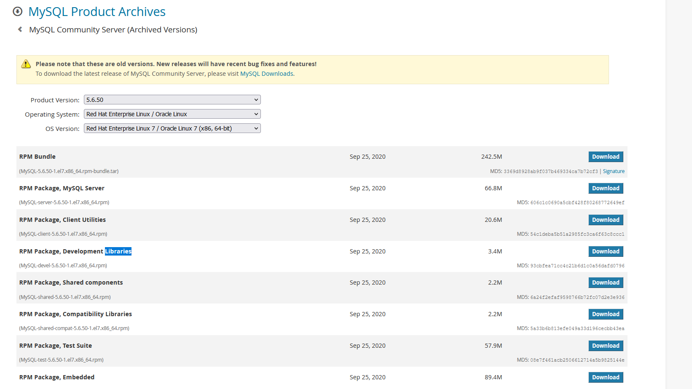

# centos7安装mysql离线方式

## 1.官网下载MySQL离线RPM包

① 查看系统版本

```
cat /etc/system-release
uname -a
```

2官网选择对应的rpm包（这里选择rpm包套件：RPM Bundle）

```
下载地址：https://dev.mysql.com/downloads/mysql/5.6.html#downloads
```




# 2.将下载离线tar包上传至centos7服务器上，并解压

### 1.解压tar文件获取里面的rpm包

```
tar -xvf MySQL-xxxx.rpm-bundle.tar
```

### 2.解压完成后有七个包，

这里我是全部安装了。至于这七个包的作用看官方参考手册：

官方参考手册地址：https://dev.mysql.com/doc/refman/5.6/en/linux-installation-rpm.html

### 3、将原有的mariadb数据库卸载

```
rpm -qa | grep mariadb
```

```
 rpm -e --nodeps 返回的文件名
```

### 4、开始安装MySQL

#### 1建议顺序

```
rpm -ivh MySQL-client-5.6.46-1.el7.x86_64.rpm
rpm -ivh MySQL-devel-5.6.46-1.el7.x86_64.rpm
rpm -ivh MySQL-embedded-5.6.46-1.el7.x86_64.rpm
rpm -ivh MySQL-shared-5.6.46-1.el7.x86_64.rpm
rpm -ivh MySQL-shared-compat-5.6.46-1.el7.x86_64.rpm
rpm -ivh MySQL-test-5.6.46-1.el7.x86_64.rpm  --force --nodeps
rpm -ivh MySQL-server-5.6.46-1.el7.x86_64.rpm  --force --nodeps
```

报错

```

[root@localhost vagrant]# rpm -ivh MySQL-test-5.6.50-1.el7.x86_64.rpm
warning: MySQL-test-5.6.50-1.el7.x86_64.rpm: Header V3 DSA/SHA1 Signature, key ID 5072e1f5: NOKEY
error: Failed dependencies:
        perl(Data::Dumper) is needed by MySQL-test-5.6.50-1.el7.x86_64

```

```
需要这么
yum install -y perl perl-devel autoconf libaio
```

**这里将MySQL-server包放最后安装时因为要看它的安装输出文件**

### 5登录MySQL，并进行基础配置

#### ① 查看MySQL的初始密码

```
cat /root/.mysql_secret | grep 'password'
```

#### ②开启MySQL服务

```
systemctl restart mysql.service
```

#### ③ 使用初始密码登录MySQL

```
mysql -u root -p
```

Enter password:复制粘贴随机密码登录即可

#### ④ 修改登录密码

```
第一种方式：
mysql> set password=password('123456');
第二种方式：
mysql> set password for 'root'@'localhost'=password('456789');
```

#### ⑤ 将MySQL加入系统服务，并设置开机启动

```
chkconfig --add mysql
chkconfig mysql on
```

#### ⑥开启远程访问

```
mysql -u root -p
use mysql
grant all privileges on *.* to 'root'@'%' identified by 'your_password'; 
#刷新权限
flush privileges; 
```

#### ⑦开放端口

```
 firewall-cmd --zone=public --add-port=3306/tcp --permanent  #添加防火墙开放端
 systemctl restart firewalld.service
```

