## Spring事务传播类型

## 二、**Spring事务传播属性**

**1) required（默认属性）**
如果存在一个事务，则支持当前事务。如果没有事务则开启一个新的事务。 
被设置成这个级别时，会为每一个被调用的方法创建一个逻辑事务域。如果前面的方法已经创建了事务，那么后面的方法支持当前的事务，如果当前没有事务会重新建立事务。 

**2) Mandatory**
支持当前事务，如果当前没有事务，就抛出异常。 

**3) Never**
以非事务方式执行，如果当前存在事务，则抛出异常。 

**4) Not_supports**
以非事务方式执行操作，如果当前存在事务，就把当前事务挂起。 

**5) requires_new**
新建事务，如果当前存在事务，把当前事务挂起。 

**6) Supports**
支持当前事务，如果当前没有事务，就以非事务方式执行。 

**7) Nested**
支持当前事务，新增Savepoint点，与当前事务同步提交或回滚。 
嵌套事务一个非常重要的概念就是内层事务依赖于外层事务。外层事务失败时，会回滚内层事务所做的动作。而内层事务操作失败并不会引起外层事务的回滚。 

### **具体分析如下**

```
 简介： 通过举例Spring 父方法、子方法调用以及事务传播机制验证 
```

本文主要是讲述Spring事务传播机制，也就是大家开发过程中多多少少会遇到的父方法调用子方法，或者A方法调用B方法时事务的传播机制问题，但是在开始讲Spring事务传播机制之前需要先讲一下Spring事务的几种传播类型，如图

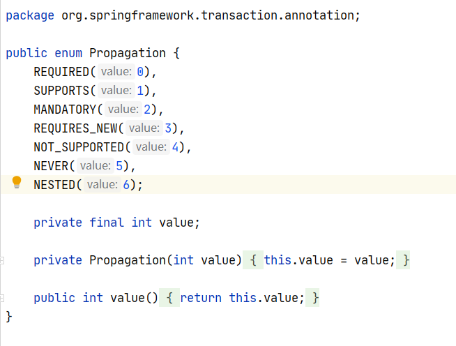

### REQUIRED

REQUIRED 表示如果当前么欸有事务，就创建一个事务，如果已经存在一个事务，就假如该事务，是spring默认的事务传播类型

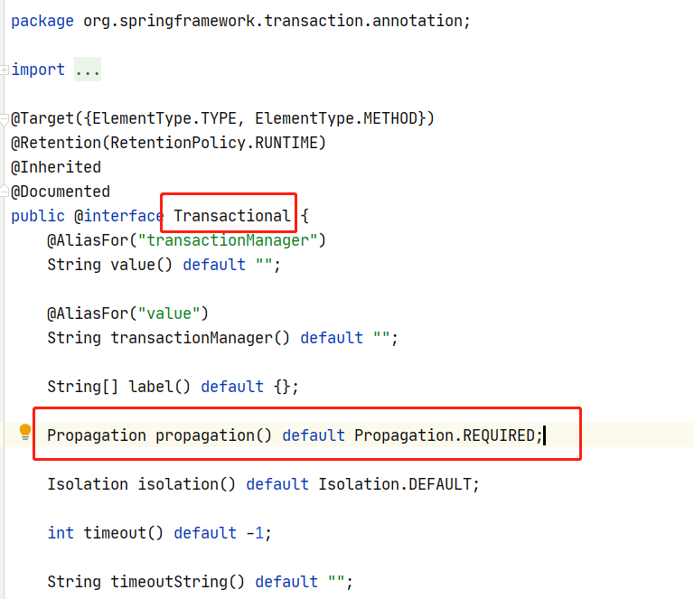

也就是说如果不存在事务，就开启新的事务，如果外部存在事务，就假如该事务钟，如果调用这发生异常，那么调用这和被调用者的事务不回滚。

### SUPPORTS

SUPPORTS 表示支持但当前事务，如果当前没有事务，就以非事务的方式执行，**也就是说不存在事务，不会开启事务，外部存在事务就加入该事务**

### MANDATORY

MANDATORY表示支持当前事务，但是跟SUPPORTS不同的是这种事务传播类型具备**强制性**，**当前操作必须存在事务，如果不存在**，则抛出异常

### REQUIRES_NEW

REQUIRES_NEW表示如果当前存在事务，则把当前事务挂起，重新创建新的事务并执行，知道新的事务提交或回滚，才会恢复执行原来的事务。这种事务传播类型新创建的事务和被挂起的事务没有任何关系，他们是两个相互独立的事务，外部事务失败后回滚，**不会回滚内部事务的执行结果，内部事务执行失败抛出异常，被外部事务捕获时，外部事务可以不处理内部事务的回滚操作**。

### NOT_SUPPORTED

NOT_SUPPORTED**表示以非事务方式执行**，如果当前操作在一个事务中，就把当前事务挂起，以非事务方式运行，直到操作完成再恢复事务执行。

### NEVER

NEVER表示以非事务的方式执行，**如果当前操作存在事务，则抛出异常**。

### NESTED

NESTED表示如果当前方法有一个事务正在运行，则这个方法应该运行在一个嵌套事务中，被嵌套的事务可以独立于被封装的事务进行提交或回滚，**也就是说如果封装事务存在，并且外层事务异常回滚，那么内层事务必须回滚**，如果内层事务回滚，不影响外层事务的提交和回滚，当封装事务不存在时，按照REQUIRED事务传播类型执行

### 无事务情况

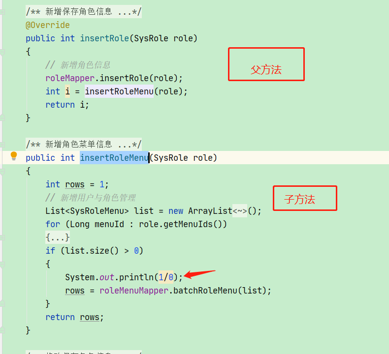

设置insertRoleMenu 内部发生异常，则insertRole 保存角色（普通角色）成功，insertRoleMenu 绑定角色菜单失败，验证结果

### 父方法未开启事务，子方法开启事务

父方法未开启事务，子方法开启默认事务传播类型REQUIRED，代码如图

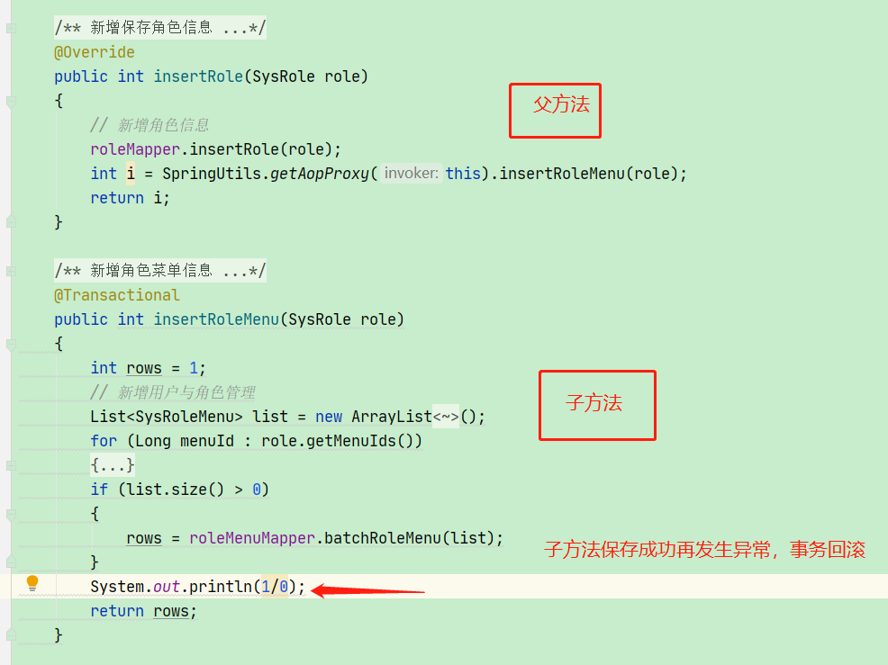

设置insertRoleMenu 内部发生异常，同时insertRoleMenu 开启Spring默认事务，而insertRole未添加事务注解，则insertRole保存角色（普通角色1）成功，insertRoleMenu 绑定角色菜单内部发生异常，事务回滚，验证结果

### 父方法开启事务，子方法未开启事务

父方法开启默认事务传播类型，子方法未开启事务，代码如图

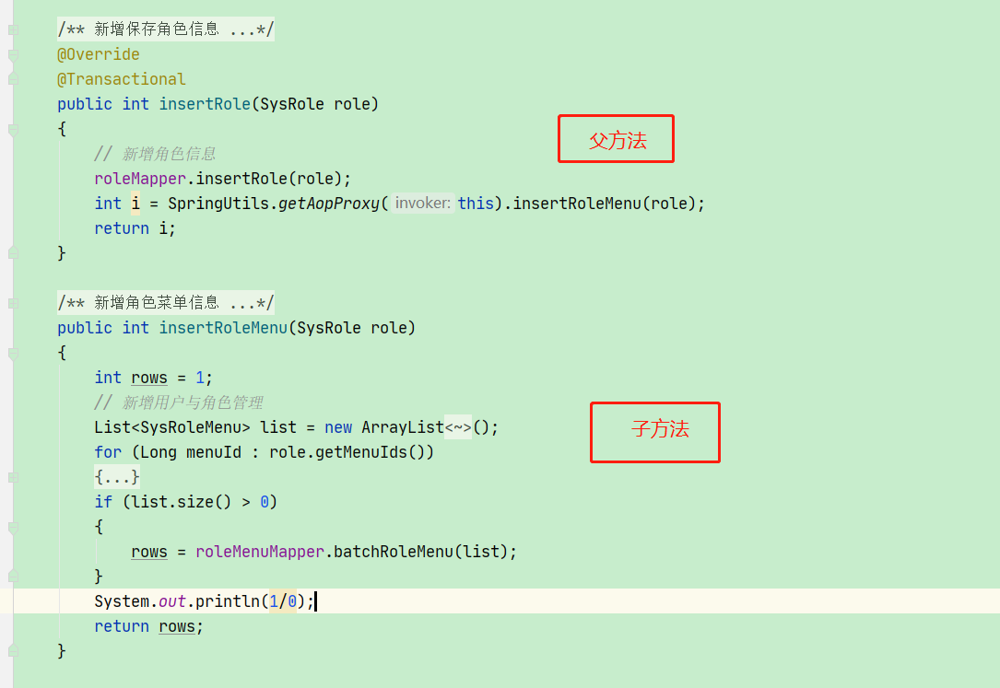

设置insertRoleMenu 内部发生异常，同时insertRole 开启Spring默认事务，而insertRoleMenu未添加事务注解，则insertRoleMenu 内部发生异常，会影响外部insertRole方法的执行，此时均发生回滚，验证结果

### 父方法开启事务，子方法开启事务

父方法开启Spring默认事务传播类型，子方法开启Spring默认事务传播类型

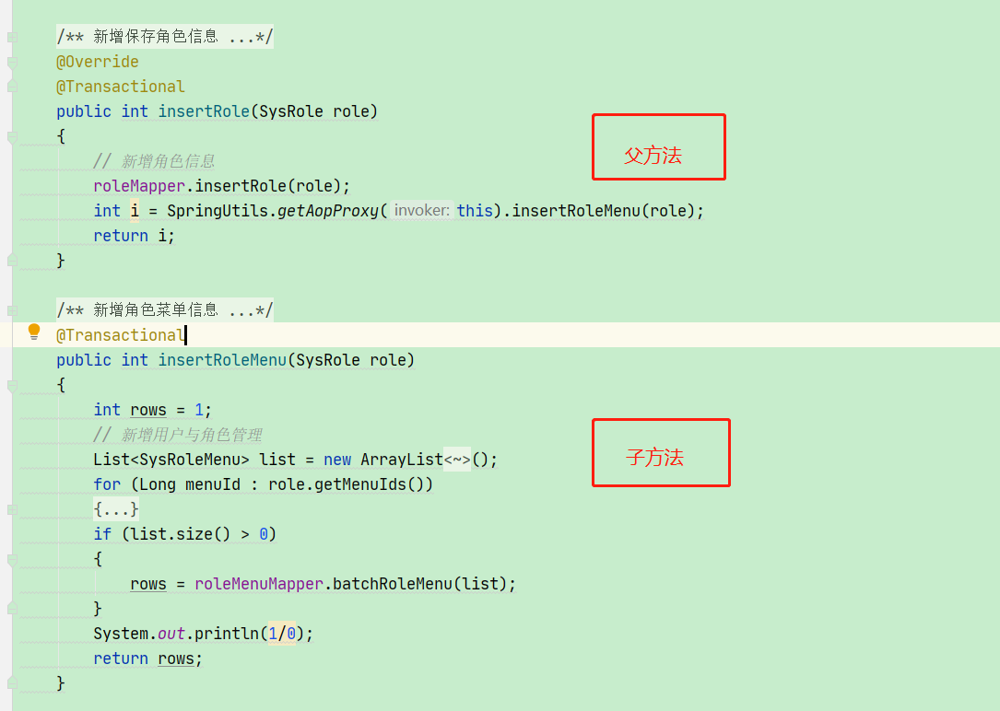

设置insertRoleMenu 内部发生异常，同时insertRole 开启Spring默认事务，insertRoleMenu开启Spring默认事务，则insertRoleMenu 内部发生异常，会影响外部insertRole方法的执行，此时均发生回滚，验证结果

### 父方法开启REQUIRED事务，子方法开启NOT_SUPPORTED事务

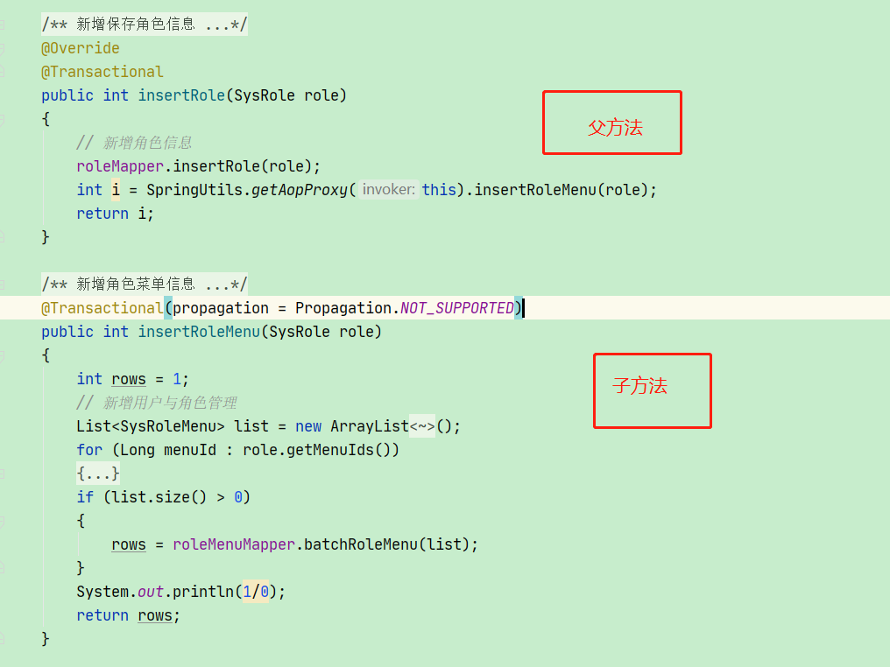

设置insertRoleMenu 内部发生异常，同时insertRole 开启Spring默认事务，insertRoleMenu开启Spring NOT_SUPPORTED事务，由于insertRoleMenu将父方法事务挂起，且执行绑定角色菜单之后发生异常，则insertRoleMenu会执行成功，同时由于子方法发生异常，则会影响外部insertRole方法的执行，则insertRole执行失败，事务回滚，验证结果

### 父方法开启REQUIRED事务，子方法开启REQUIRES_NEW事务

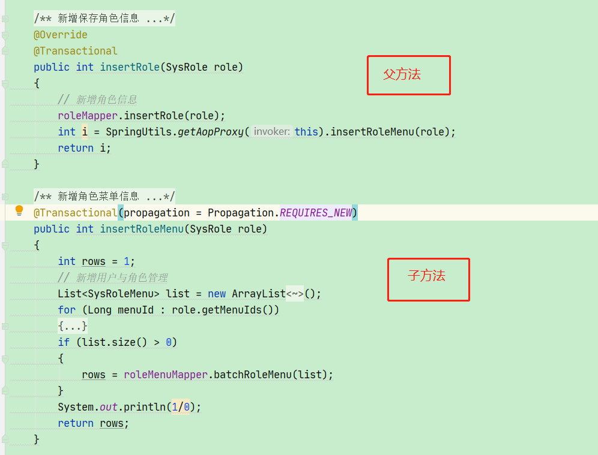

设置insertRoleMenu 内部发生异常，同时insertRole 开启Spring默认事务，insertRoleMenu开启Spring REQUIRES_NEW事务，此时insertRoleMenu发生异常时，则insertRoleMenu、insertRole均会执行失败，事务回滚，验证结果

### 父方法开启REQUIRED事务，子方法开启REQUIRES_NEW事务

父方法开启Spring默认事务传播类型，子方法开启Spring REQUIRES_NEW事务传播类型，与上一种不同的是，异常产生发生在父方法最后一行 **采用非内部调用**

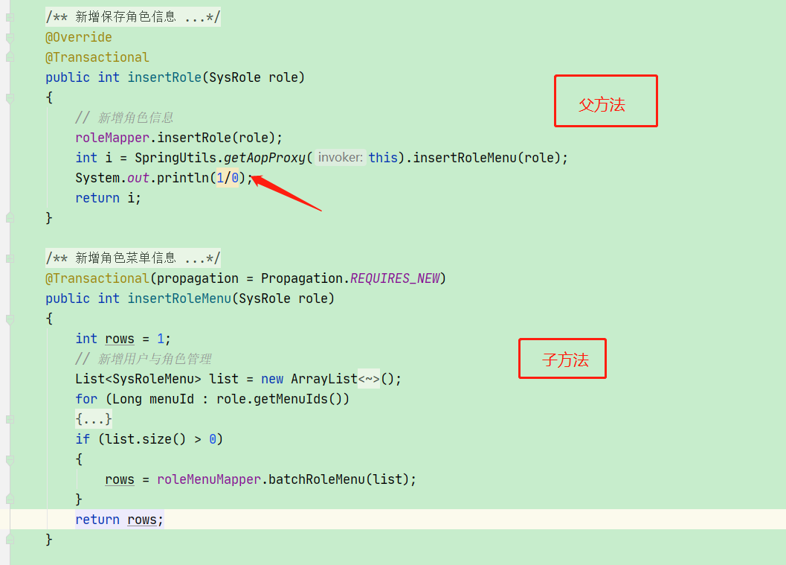

**采用非内部调用**

设置insertRole 内部发生异常，且异常发生在最后一行，同时insertRole 开启Spring默认事务，insertRoleMenu开启Spring REQUIRES_NEW事务，此时insertRole发生异常时，则insertRole均会执行失败，事务回滚，insertRoleMenu执行成功，验证结果

### 父方法开启REQUIRED事务，子方法开启REQUIRES_NEW事务

父方法开启Spring默认事务传播类型，子方法开启Spring REQUIRES_NEW事务传播类型，异常产生发生在父方法最后一行，**同时父方法、子方法是在同一个类中的内部调用**

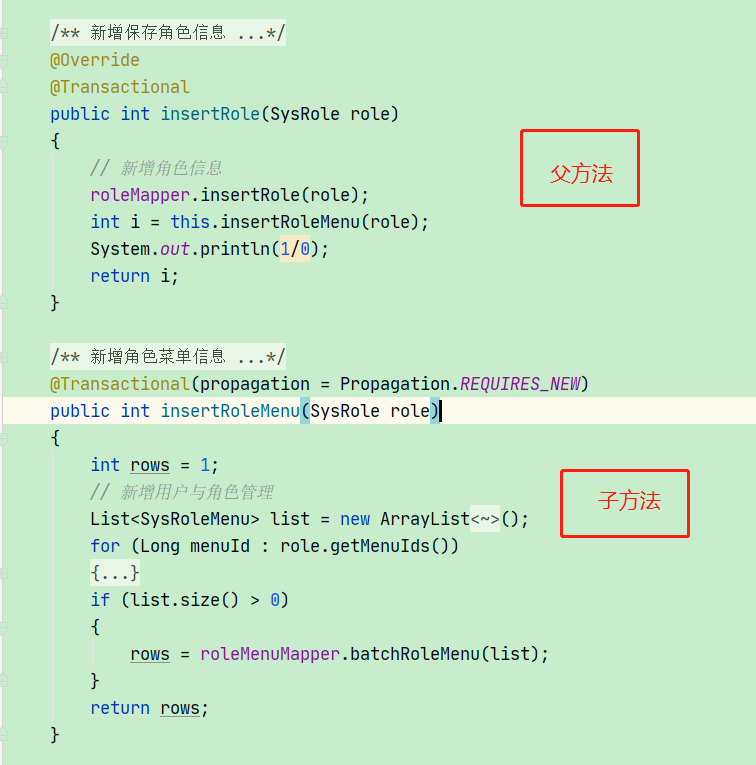

设置insertRole 内部发生异常，且异常发生在最后一行，同时insertRole 开启Spring默认事务，insertRoleMenu开启Spring REQUIRES_NEW事务，此时insertRole发生异常时，则insertRole、insertRoleMenu执行失败，事务回滚，验证结果

## Spring 事务失效场景

### 数据库不支持事务

Spring事务生效的前提是连接的数据库存储引擎支持事务，比如Mysql 的MyISAM存储引擎不支持事务，则Spring事务会失效

### 事务方法未被Spring管理

如果事务所在的类没有被交给Spring 管理，或者说没有加载到Spring IOC容器中，则该类方法上的事务会失效，比如

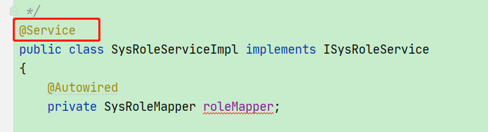

如果没有@Service注解，则该类下的方法上的事务会失效。

### 事务方法私有private

如果事务注解的方法为内部的私有private方法，则事务会失效。

### 同一个类中的方法调用

同一个类中的父方法调用子方法，都开启了事务，如图

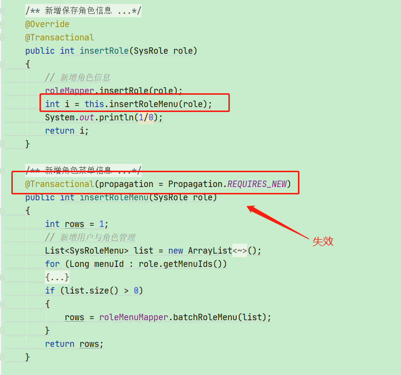

子方法的事务会失效

### 不正确的异常捕获

如果发生异常的代码被try catch捕获，则Spring 管理器无法感知到异常，导致事务失效。

### 错误的异常类型

Spring 事务默认的捕获的异常是RuntimeException，如果代码中执行失败抛出了Exception异常，则事务会失效